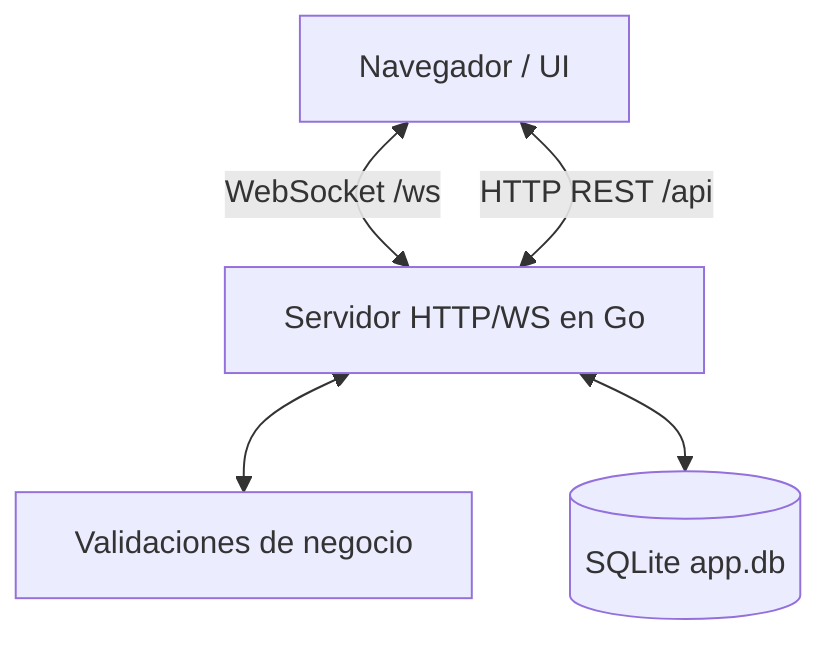

# 🥋 Taekwondo Miranda — Sistema de Gestión de Atletas

**Registro y seguimiento de atletas de la asociación estatal de Taekwondo del Edo. Miranda.**
*Arquitectura ultra-portátil en Go + SQLite + WebSockets. Un solo ejecutable, sin instaladores.*

---

## 📌 Estado actual (v1 — base)

Primera entrega funcional que incluye el esqueleto portátil completo:

- ✅ **Binario único** (`app.exe`) con frontend embebido (`go:embed`) y SQLite CGO-free.
- ✅ **Arranque automático:** abre el navegador en `http://localhost:8080`.
- ✅ **Login de entrenadores** con contraseñas cifradas (bcrypt) y sesiones por cookie.
- ✅ **Rol administrador** (`es_admin`): acceso a acciones sensibles (eliminar atletas).
- ✅ **CRUD de atletas** con todas las reglas de negocio del modelo:
  - DAN obligatorio solo en cinturón negro (1–9); NULL en el resto.
  - Representante obligatorio para menores de 18 (su teléfono se usa como contacto).
  - Fecha de inscripción con día opcional (mes/año cuando el día es desconocido).
- ✅ **Cinturón como línea de tiempo** (`historial_cinturon`) y **periodos de actividad**
  (retiro/reactivación sin perder antigüedad).
- ✅ **Búsqueda por facetas** + **filtro avanzado tipo Odoo** (dominio booleano all/any) y paginación con rango editable.
- ✅ **Ubicación jerárquica** Estado › Ciudad › Municipio › Parroquia (autorrelleno y filtrado en cascada), con toda la geografía de Venezuela sembrada.
- ✅ **Roles**: Administrador (acceso total) y Consultor (solo lectura).
- ✅ **Gestión** con sidebar: Atletas, Escuelas, Usuarios, Datos maestros (CRUD geografía/cinturones), Reportes y Respaldo.
- ✅ **Reportes PDF** (servidor Go puro) con la búsqueda filtrada + resumen agregado.
- ✅ **Respaldo**: descarga de la BD completa y export/import por tabla (CSV) — solo administrador.
- ✅ **Auditoría** de cambios y **sincronización en vivo** por WebSocket.

### Pendiente (próximas iteraciones)
- Carga y almacenamiento de fotos de atletas.

---

## 🚀 Uso

### Usuario final
```powershell
.\app.exe
```
Se abre el navegador automáticamente. Credenciales iniciales:

| Usuario | Contraseña |
|---------|------------|
| `admin` | `admin123` |

> ⚠️ Cambie la contraseña del administrador tras el primer ingreso
> (botón **Cambiar clave**). La base de datos se crea sola en `app.db`.

### Desarrollo
Requiere **Go 1.25+**.
```bash
cd src
go run .            # modo desarrollo
```
Compilar el binario portátil:
```bash
cd src
# Windows
CGO_ENABLED=0 go build -ldflags="-s -w" -o ..\app.exe .
# Linux / macOS
CGO_ENABLED=0 go build -ldflags="-s -w" -o ../app .
```

### Icono y logo
- El **logo** de la app vive en `src/frontend/logo.png` (embebido, servido en `/logo.png`
  como favicon y en la cabecera).
- El **icono del `.exe`** se incrusta vía el recurso `src/rsrc_windows_amd64.syso`, que el
  linker de Go incluye automáticamente en cada `go build`. Si cambia el logo, regenéralo:
  ```bash
  cd src
  # 1) PNG → ICO multi-resolución (requiere Pillow)
  python -c "from PIL import Image; i=Image.open('logo.png').convert('RGBA').resize((256,256)); i.save('icon.ico', sizes=[(16,16),(32,32),(48,48),(64,64),(128,128),(256,256)])"
  # 2) ICO → recurso Windows (requiere github.com/akavel/rsrc)
  rsrc -ico icon.ico -o rsrc_windows_amd64.syso
  ```

---

## 🗂️ Estructura

```
zon-taekwondo/
├── app.exe                 # Ejecutable portátil (compilado)
├── app.db                  # Base de datos SQLite (auto-generada)
├── schema.sql              # Fuente de verdad del modelo de datos
├── MODELO_DATOS.md         # Reglas de negocio
└── src/
    ├── main.go             # Entry point: embed, init DB, servidor, auto-navegador
    ├── database/           # Persistencia SQLite (CGO-free) + schema embebido
    ├── backend/            # HTTP REST + sesiones + Hub WebSocket + validaciones
    └── frontend/           # UI embebida (HTML + CSS + JS vanilla)
```

## ⚙️ Arquitectura



## 🔌 API principal

| Método | Ruta | Descripción |
|--------|------|-------------|
| POST | `/api/login` · `/api/logout` | Autenticación |
| GET  | `/api/me` · POST `/api/profile` | Perfil / cambio de usuario y contraseña |
| GET  | `/api/catalogos` · `/api/geo` | Cinturones/escuelas · jerarquía geográfica |
| GET/POST | `/api/atletas` | Listar (facetas + `domain`) / crear (admin) |
| GET/PUT/DELETE | `/api/atletas/{id}` | Ficha / editar / eliminar (admin) |
| POST | `/api/atletas/{id}/cinturon` · `/retirar` · `/reactivar` | Grado y periodos (admin) |
| GET/POST/PUT/DELETE | `/api/escuelas[/{id}]` | ABM de escuelas (mutar: admin) |
| GET/POST/PUT/DELETE | `/api/maestros/{tipo}[/{id}]` | Datos maestros: estados, ciudades, municipios, parroquias, cinturones |
| GET/POST/PUT/DELETE | `/api/usuarios[/{id}]` | Usuarios del sistema (solo admin) |
| GET  | `/api/reportes/atletas.pdf` | Reporte PDF de la búsqueda filtrada |
| GET  | `/api/backup/db` · `/api/backup/tabla/{t}` | Respaldo BD / export·import CSV (admin) |
| WS   | `/ws` | Notificaciones en tiempo real |
