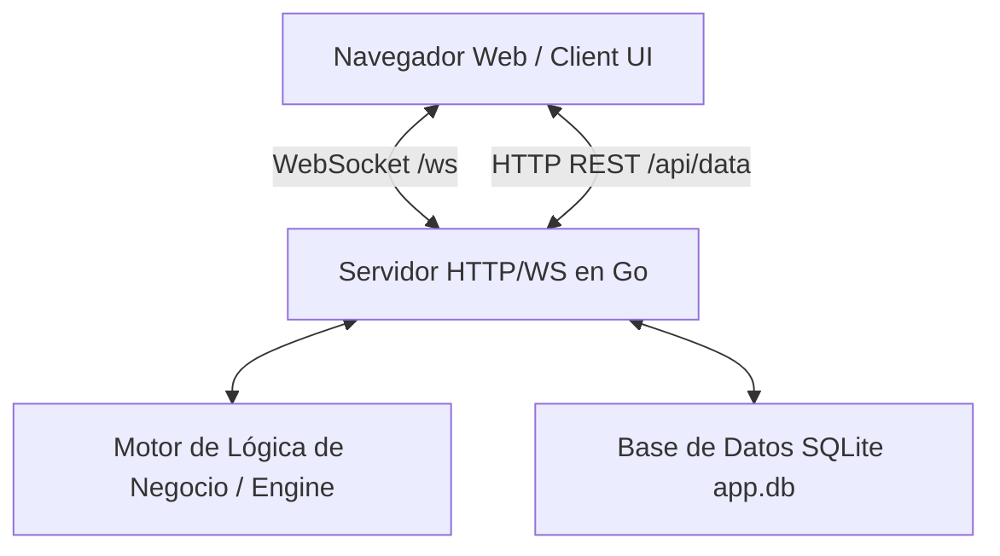

# 📐 Plantilla de Arquitectura, Estructura y Stack Portátil

Este documento sirve como plantilla para diseñar, describir y desarrollar sistemas con la misma arquitectura, stack de tecnologías y patrón de portabilidad total de preferencia por el usuario. Este puede ser escalado y añadir más carpetas.

---

## 💡 Filosofía de Diseño y Portabilidad ("Zero-Install / Plug & Play")

El objetivo principal de esta arquitectura es la **máxima portabilidad e independencia de entorno**:
1. **Ejecutable Único (Single Binary):** El frontend (HTML/CSS/JS/Imágenes) se compila **dentro** del propio binario executable en Go utilizando la característica `go:embed`. No requiere instalar Apache, Nginx, Node.js ni servidores externos.
2. **Base de Datos Autocontenida (Pure Go SQLite):** Utiliza un controlador SQLite en Go puro (`modernc.org/sqlite`) sin dependencia de CGO. No requiere GCC/Clang instalado en el sistema ni instalación de motores de base de datos como MySQL o PostgreSQL.
3. **Arranque Automático:** Al ejecutar el binario (ej. `.\sistema.exe`), este inicia el backend HTTP/WS en segundo plano y **abre automáticamente el navegador web predeterminado** apuntando a `http://localhost:8080`.
4. **Comunicación en Tiempo Real:** Comunicación bidireccional por WebSockets a alta frecuencia (5Hz - 60Hz) ideal para dashboards, simulación telemétrica o paneles de control.

---

## 🗂️ Estructura de Carpetas Estándar del Proyecto

```
nombre-del-proyecto/
├── app.db                       # Base de datos SQLite creada en tiempo de ejecución (auto-generada)
├── app.exe                      # Ejecutable binario final compilado (portátil)
├── README.md                    # Instrucciones rápidas de uso
├── DOCUMENTACION.md             # Especificación técnica del sistema actual
└── src/                         # Código fuente completo del proyecto
    ├── go.mod                   # Módulo de Go y lista de dependencias
    ├── go.sum                   # Sumas de verificación de dependencias de Go
    ├── main.go                  # Punto de entrada (Embed FS, Init DB, Engine, Server & Auto Browser)
    │
    ├── database/                # Capa de Persistencia y Datos (SQLite)
    │   ├── db.go                # Conexión, creación de tablas, migraciones y consultas
    │   └── db_test.go           # Pruebas unitarias del módulo de base de datos
    │
    ├── backend/                  # Capa de Red (HTTP REST + WebSockets Hub)
    │   ├── server.go            # Configuración de rutas HTTP y Middleware estático embebido
    │   └── websocket.go         # Manejador de conexiones WebSockets, Hub y Broadcast
    │
    └── frontend/                # Interfaz Web UI Embebida (Servida vía go:embed)
        ├── index.html           # Estructura HTML5 del Dashboard/UI
        ├── assets/              # Archivos estáticos (imágenes, fuentes, datos GeoJSON, etc.)
        ├── css/
        │   └── style.css        # Estilos visuales (Tema Dracula, Sci-Fi/Dark Mode, Responsive)
        └── js/
            └── app.js           # Lógica del cliente, renderizado Canvas 2D, WebSockets y UI
```

---

## 🛠️ Stack Tecnológico Utilizado

| Componente | Tecnología | Razón de Selección |
| :--- | :--- | :--- |
| **Lenguaje Backend** | **Go (Golang 1.20+)** | Alto rendimiento, manejo eficiente de hilos con Goroutines, compilación nativa a un solo ejecutable binario. |
| **Base de Datos** | **SQLite (`modernc.org/sqlite`)** | Base de datos relacional autocontenida en un archivo `.db`. CGO-Free para compilar cross-platform sin GCC. |
| **Servidor Web & API** | **`net/http` (Standard Library)** | Servidor HTTP de alto rendimiento integrado en Go. |
| **Protocolo Realtime** | **`gorilla/websocket`** | Comunicación bidireccional en tiempo real para transmisión continua de estado y datos. |
| **Empaquetado Frontend** | **`embed` & `io/fs` (Go Standard)** | Incorpora todo el directorio `frontend/` dentro del ejecutable en tiempo de compilación. |
| **Frontend UI** | **HTML5 + Vanilla JS + CSS3** | Sin frameworks pesados ni proceso de compilación `npm build` previo para ejecutar. Carga instantánea. |
| **Renderizado Gráfico** | **HTML5 Canvas 2D / SVG** | Para componentes interactivos dinámicos de alta velocidad (instrumental, gráficos, visualizaciones). |

---

## 📄 Plantilla Markdown para Explicar tu Nuevo Sistema

*Puedes copiar y pegar la siguiente plantilla en el `DOCUMENTACION.md` o `README.md` de tu nuevo proyecto para explicarlo con esta misma estructura:*

```markdown
# [NOMBRE DE TU NUEVO SISTEMA]

**[Subtítulo o Breve Descripción del Propósito del Sistema]**  
*Desarrollado con arquitectura ultra-portátil en Go, SQLite y WebSockets*

---

## 📌 Descripción General

[Escribe aquí una breve explicación de qué hace tu sistema, qué problema resuelve y quiénes son sus usuarios principales].

### Características Principales:
- 🚀 **Portabilidad Total:** Un solo archivo ejecutable `.exe` sin requerir instaladores ni servidores externos.
- ⚡ **Tiempo Real:** Transmisión continua de eventos mediante WebSockets.
- 💾 **Persistencia Local:** Almacenamiento eficiente en base de datos SQLite integrada.
- 🎨 **Interfaz Moderna:** Dashboard UI embebido en el binario con tema oscuro/científico.

---

## ⚙️ Arquitectura del Sistema

El sistema utiliza una arquitectura desacoplada cliente-servidor con actualización bidireccional en tiempo real:



---

## 🛠️ Estructura del Proyecto

- `app.exe`: Ejecutable portable autocontenido.
- `app.db`: Archivo de base de datos SQLite generado automáticamente.
- `src/`:
  - `main.go`: Punto de entrada, empaquetado `go:embed`, servidor HTTP y apertura de navegador.
  - `database/`: Gestión de SQLite (CGO-Free).
  - `server/`: Rutas REST y Hub de WebSockets.
  - `simulation/` (o `domain/`): Lógica de negocio y motor de eventos.
  - `frontend/`: Archivos HTML, CSS, JavaScript y assets estáticos embebidos.

---

## 🚀 Compilación y Ejecución

### Ejecución Directa (Usuario Final):
Simplemente ejecute el archivo binario:
```powershell
.\app.exe
```
Se abrirá automáticamente el navegador en `http://localhost:8080`.

### Compilación desde el Código Fuente (Desarrollador):
Requiere **Go 1.20+**.

1. Ir al directorio del código fuente:
   ```bash
   cd src
   ```
2. Ejecutar en modo desarrollo:
   ```bash
   go run main.go
   ```
3. Compilar el ejecutable portátil final para producción:
   ```bash
   # En Windows:
   CGO_ENABLED=0 go build -ldflags="-s -w" -o ..\app.exe .

   # En Linux / macOS:
   CGO_ENABLED=0 go build -ldflags="-s -w" -o ../app .
   ```
```

---

## 💡 Snippets Clave del Código para Replicar la Portabilidad

### 1. Inclusión de Frontend Embebido (`src/main.go`):
```go
package main

import (
	"embed"
	"io/fs"
	"log"
	"net/http"
)

//go:embed frontend/*
var frontendFS embed.FS

func main() {
    // Extraer el sub-filesystem de la carpeta frontend
    subFS, err := fs.Sub(frontendFS, "frontend")
    if err != nil {
        log.Fatalf("Error al cargar frontend embebido: %v", err)
    }

    // Servir archivos estáticos embebidos
    http.Handle("/", http.FileServer(http.FS(subFS)))
}
```

### 2. Apertura Automática del Navegador Web (`src/main.go`):
```go
func openBrowser(url string) {
	var err error
	switch runtime.GOOS {
	case "linux":
		err = exec.Command("xdg-open", url).Start()
	case "windows":
		err = exec.Command("rundll32", "url.dll,FileProtocolHandler", url).Start()
	case "darwin":
		err = exec.Command("open", url).Start()
	}
	if err != nil {
		log.Printf("No se pudo abrir el navegador automáticamente: %v", err)
	}
}
```

### 3. Conexión SQLite sin CGO (`src/database/db.go`):
```go
import (
	"database/sql"
	_ "modernc.org/sqlite" // Driver 100% Go puro, CGO-Free
)

func InitDB(filepath string) (*sql.DB, error) {
	db, err := sql.Open("sqlite", filepath)
	if err != nil {
		return nil, err
	}
	return db, nil
}
```

---

## 🎯 Resumen de Pasos para Crear un Nuevo Proyecto con esta Estructura

1. Crear la carpeta raíz de tu proyecto `mi-nuevo-sistema/`.
2. Crear la subcarpeta `src/` con sus módulos: `database/`, `server/`, `domain/` y `frontend/`.
3. Iniciar el módulo de Go dentro de `src/`:
   ```bash
   cd src
   go mod init mi-nuevo-sistema
   go get modernc.org/sqlite
   go get github.com/gorilla/websocket
   ```
4. Colocar la interfaz gráfica en `src/frontend/` (`index.html`, `style.css`, `app.js`).
5. Configurar `main.go` con `//go:embed frontend/*` para servir la UI y abrir el navegador.
6. Compilar con `CGO_ENABLED=0 go build -o ..\mi-nuevo-sistema.exe .`.

¡Listo! Tendrás un sistema autocontenido, ultra-rápido, multiplataforma y 100% portátil.
